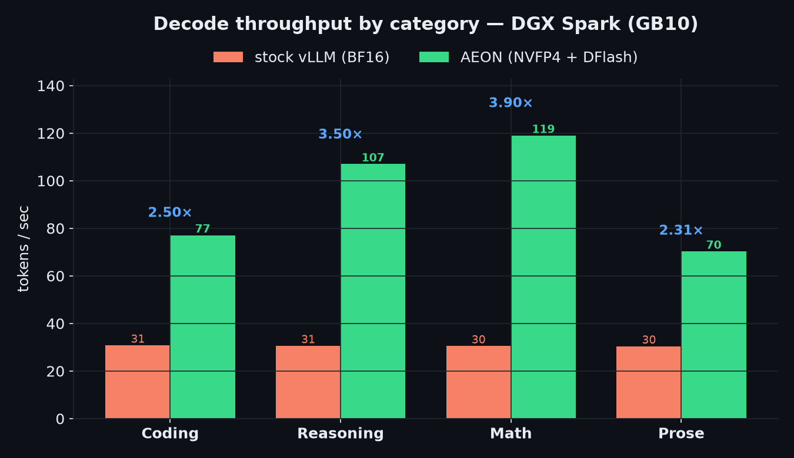

# Ornith-1.0-35B — AEON Ultimate Uncensored

Uncensored / abliterated build of [`deepreinforce-ai/Ornith-1.0-35B`](https://huggingface.co/deepreinforce-ai/Ornith-1.0-35B), DeepReinforce's SOTA agentic-coding MoE — **refusals removed, capability preserved.**

| | |
|---|---|
| **BF16** (~66 GB, any vLLM) | [`AEON-7/Ornith-1.0-35B-AEON-Ultimate-Uncensored-BF16`](https://huggingface.co/AEON-7/Ornith-1.0-35B-AEON-Ultimate-Uncensored-BF16) |
| **NVFP4** (~23.7 GB, near-lossless, Blackwell) | [`AEON-7/Ornith-1.0-35B-AEON-Ultimate-Uncensored-NVFP4`](https://huggingface.co/AEON-7/Ornith-1.0-35B-AEON-Ultimate-Uncensored-NVFP4) |
| License | MIT (inherited from base) |

## TL;DR
- **0 / 80 refusals (0.0%)** on diverse harmful prompts (base ≈ 94/100) — fully uncensored.
- **0 coding-capability loss** — agentic pass@1 **0.833, identical to the base** family-by-family. Near-lossless (KL ≈ 0.0014).
- Hybrid `qwen3_5_moe`: 40 layers (30 GatedDeltaNet + 10 full-attn), 256 experts + shared (A3B), vision, 256K ctx, thinking model.
- **NVFP4 + DFlash on a DGX Spark: 3.05× faster decode** (avg 93 vs 30 tok/s) and **2.75× prefill** vs a stock-vLLM BF16 deploy.

## Performance — DGX Spark (GB10), single-stream

The optimized deploy (**AEON container + NVFP4 + DFlash n=6**) vs a naive **stock vLLM + BF16** deploy on the same Spark:

| Workload | Stock vLLM (BF16) | AEON (NVFP4 + DFlash) | Speedup |
|---|---|---|---|
| Coding | 30.8 tok/s · 237 ms | **77.1 · 94 ms** | **2.5×** |
| Reasoning | 30.6 · 247 ms | **107.0 · 93 ms** | **3.5×** |
| Math | 30.5 · 221 ms | **119.0 · 88 ms** | **3.9×** |
| Prose | 30.4 · 193 ms | **70.3 · 91 ms** | **2.3×** |
| Avg decode | 30.6 | **93.3** | **3.05×** |
| Prefill | 3,517 tok/s | **9,661 tok/s** | **2.75×** |



▶ **[Benchmark animation (MP4)](benchmarks/ornith_nvfp4_dflash_benchmark.mp4)** · 📖 **[DGX Spark QuickStart](QUICKSTART_DGX_SPARK.md)** (optimal settings: NVFP4 + DFlash n=6, `--gpu-memory-utilization 0.7`)

## Quickstart (vLLM)
```bash
vllm serve AEON-7/Ornith-1.0-35B-AEON-Ultimate-Uncensored-BF16 \
  --served-model-name ornith --max-model-len 262144 \
  --gpu-memory-utilization 0.85 --max-num-batched-tokens 16384 \
  --mamba-cache-dtype float32 --reasoning-parser qwen3 \
  --enable-prefix-caching --trust-remote-code
```
Thinking model (`<think>…</think>` every turn). Sampling: `temperature 0.6, top_p 0.95, top_k 20`. Vision intact (BF16 KV on vision deploys). See [`serve_ornith.sh`](serve_ornith.sh).

## How it was built (4 stages)
1. **SSM `conv1d` outlier repair** — rescale outlier blocks (layers 36/37) pre-abliteration to prevent coherence collapse.
2. **Abliteration** — `abliterix` v1.9: grimjim norm-preserving biprojection + **Expert-Granular Abliteration** across all 256 fused experts + shared expert + router suppression; Optuna refusals-vs-KL search. Q/K/V untouched (`attn_output_gate`); GatedDeltaNet/SSM internals + vision tower **not modified**. Recipe: [`config/ornith_35b.toml`](config/ornith_35b.toml).
3. **Gentle-knee selection** — the lowest-refusal trial was *over-abliterated* (word-salad on real generation). Shipped a 170× lighter expert edit for the same refusal removal, verified coherent.
4. **Export + quantize.** Export bf16 on a box where 70 GB fits in memory (GB10's 121 GB unified pool cannot edit-in-memory). **NVFP4 (shipped):** MLP-only weight-only NVFP4 (W4A16) via llm-compressor → compressed-tensors — experts + shared-MLP in NVFP4, attention + GatedDeltaNet + vision + gates + embeds in BF16. Quantized on a **B200 (Blackwell)**, validated served on a DGX Spark (GB10): **identical** to BF16 — agentic-coding 0.833 (15/18), 0 refusals, 0 degenerate, ~23.7 GB. Weight-only (BF16 activations) is the key: the NVFP4 reasoning penalty comes from FP4 *activations* (W4A4), which W4A16 avoids. **FP8 is *not viable*** on this hybrid arch (W8A8 degrades coherence; W8A16 has no ScaledMM kernel) — NVFP4 is the low-precision path.

## Validation
| Metric | Base Ornith-1.0-35B | This model |
|---|---|---|
| Refusals (80 harmful: CBRN/cyber/weapons/self-harm) | high | **0 / 80 (0.0%)** |
| Agentic/coding pass@1 (18-task probe) | 0.833 | **0.833 (identical)** |
| First-token KL vs base | — | **~0.0014** |

Base capability context (preserved, per the coding-delta check): Terminal-Bench 2.1 = 64.2, SWE-bench Verified = 75.6.

## Responsibility
Safety refusals removed — **will comply with harmful requests.** For research (alignment, red-teaming, uncensored assistants). You are solely responsible for use; obey applicable law. No warranty.

## Provenance
Base [deepreinforce-ai/Ornith-1.0-35B](https://huggingface.co/deepreinforce-ai/Ornith-1.0-35B) · driver [abliterix](https://github.com/wuwangzhang1216/abliterix) / [heretic](https://github.com/p-e-w/heretic) · methods grimjim (NPBA), Arditi et al. 2024, FernflowerAI (SSM repair) · build AEON-7.
